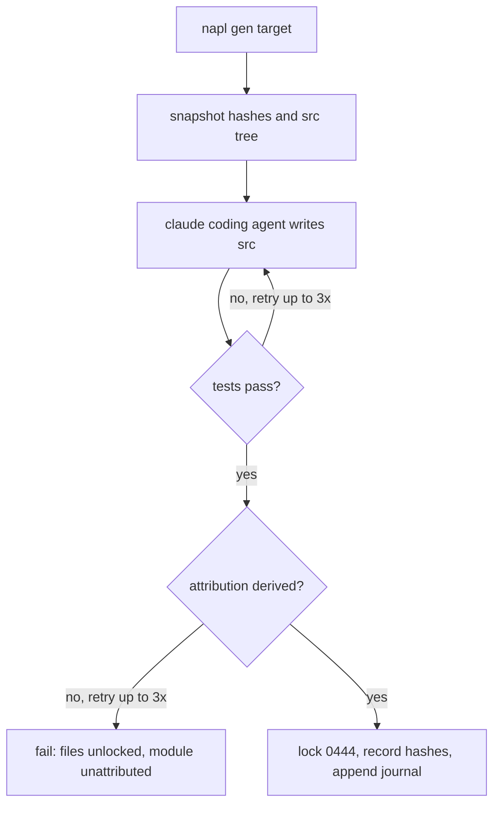

`napl gen <target>` is the heart of the toolchain. It runs, for each prompt whose content hash
changed for that target, a full agentic session and then a sequence of gates. Nothing is locked
until the connection between prose and code is proven.

## The stages

<Steps>

<Step>

### Snapshot

`napl gen` records content hashes and snapshots the current target src tree (`.napl/src/<target>/`),
so the change the agent makes can later be observed as a diff.

</Step>

<Step>

### Agent

A `claude` coding agent runs with its working directory set to the target src tree. It may scaffold
the project, run package managers, and edit many files freely — the AI is not constrained to a
pipeline.

</Step>

<Step>

### Test gate

The target's test command runs (for example `vitest run`, or `cargo test` for Rust). On failure,
the output is fed back to the agent and the run retries — up to three times — before failing loudly.

</Step>

<Step>

### Attribution gate

On green, the toolchain diffs the tree, attributes each changed file to the driving prompt in
`map.json`, and asks the model to map prompt lines to code lines. This span attribution is a
**hard gate**: it is retried up to three times with progressively stricter instructions, and
rejected if it fails schema validation, has no entries while files were attributed, or references a
file outside the attributed set.

</Step>

<Step>

### Lock

Only if attribution succeeds are the files locked `0444` and their hashes recorded. IR derivation
(`.napl/ir/<module>.yaml`) runs best-effort — a failure there only logs a warning. A successful gen
also appends one line to the [journal](/docs/cli/blame) for prompt-blame.

</Step>

</Steps>

## The flow

## When attribution fails

If all three attribution attempts fail, `gen` fails for that module: the files are **left
unlocked**, the `promptHashAtGen` is **not** recorded (so the next `gen` re-runs it), and the target
entry is flagged `unattributed` in `map.json`. `napl status` then reports that prompt as
`unattributed` (exit `1`) until a later successful gen clears the marker. **Code without a traceable
prompt is never accepted as green.**

## Incremental by default

`napl gen` runs incrementally: only prompts whose content changed for the target are regenerated,
and the agent is instructed to make minimal edits to the owned regions. Use `--full` to force
from-scratch generation, `--force` to regenerate every prompt, and `--module <name>` to scope the
run. See the [napl gen](/docs/cli/gen) reference for all flags.
